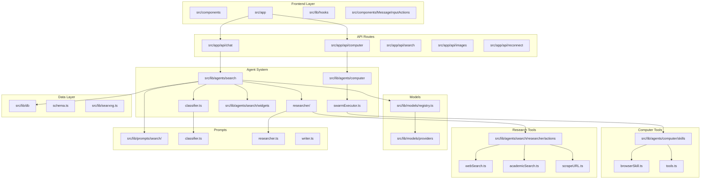

# How to Contribute to Vane

Thanks for your interest in contributing to Vane! Your help makes this project better. This guide explains how to contribute effectively.

Vane is a modern AI chat application with advanced search capabilities.

## Project Structure

Vane's codebase is organized as follows:

- **UI Components and Pages**:
  - **Components (`src/components`)**: Reusable UI components.
  - **Pages and Routes (`src/app`)**: Next.js app directory structure with page components.
    - Main app routes include: home (`/`), chat (`/c`), discover (`/discover`), and library (`/library`).
  - **API Routes (`src/app/api`)**: Server endpoints implemented with Next.js route handlers.
- **Backend Logic (`src/lib`)**: Contains all the backend functionality including search, database, and API logic.
  - The search system lives in `src/lib/agents/search`.
  - The computer-agent system lives in `src/lib/agents/computer`.
  - The search pipeline is split into classification, research, widgets, and writing.
  - The computer pipeline is split into route handling, skills/tools, swarm execution, and block streaming.
  - Database functionality is in `src/lib/db`.
  - Chat model and embedding model providers are in `src/lib/models/providers`, and models are loaded via `src/lib/models/registry.ts`.
  - Prompt templates are in `src/lib/prompts`.
  - SearXNG integration is in `src/lib/searxng.ts`.
  - Upload search lives in `src/lib/uploads`.

### Where to make changes

If you are not sure where to start, use this section as a map.

- **Search behavior and reasoning**

  - `src/lib/agents/search` contains the core chat and search pipeline.
  - `classifier.ts` decides whether research is needed and what should run.
  - `researcher/` gathers information in the background.

- **Computer mode behavior**

  - `src/lib/agents/computer` contains the computer-agent execution path.
  - `swarmExecutor.ts` handles planning, skill selection, and tool execution.
  - `skills/` defines tool access for browser, coder, researcher, and operator roles.

- **Add or change a search capability**

  - Research tools (web, academic, discussions, uploads, scraping) live in `src/lib/agents/search/researcher/actions`.
  - Tools are registered in `src/lib/agents/search/researcher/actions/index.ts`.

- **Add or change widgets**

  - Widgets live in `src/lib/agents/search/widgets`.
  - Widgets run in parallel with research and show structured results in the UI.

- **Model integrations**

  - Providers live in `src/lib/models/providers`.
  - Add new providers there and wire them into the model registry so they show up in the app.

- **Architecture docs**
  - High level overview: `docs/architecture/README.md`
  - High level flow: `docs/architecture/WORKING.md`

## API Documentation

Vane includes API documentation for programmatic access.

- **Search API**: For detailed documentation, see `docs/API/SEARCH.md`.

## Setting Up Your Environment

Before diving into coding, setting up your local environment is key. Here's what you need to do:

1. Run `npm install` to install all dependencies.
2. Use `npm run dev` to start the application in development mode.
3. Open http://localhost:3000 and complete the setup in the UI (API keys, models, search backend URL, etc.).

Database migrations are applied automatically on startup.

For full installation options (Docker and non Docker), see the installation guide in the repository README.

**Please note**: Docker configurations are present for setting up production environments, whereas `npm run dev` is used for development purposes.

## Coding and Contribution Practices

Before committing changes:

1. Ensure that your code functions correctly by thorough testing.
2. Always run `npm run format:write` to format your code according to the project's coding standards. This helps maintain consistency and code quality.
3. We currently do not have a code of conduct, but it is in the works. In the meantime, please be mindful of how you engage with the project and its community.

Following these steps will help maintain the integrity of Vane's codebase and facilitate a smoother integration of your valuable contributions. Thank you for your support and commitment to improving Vane.
