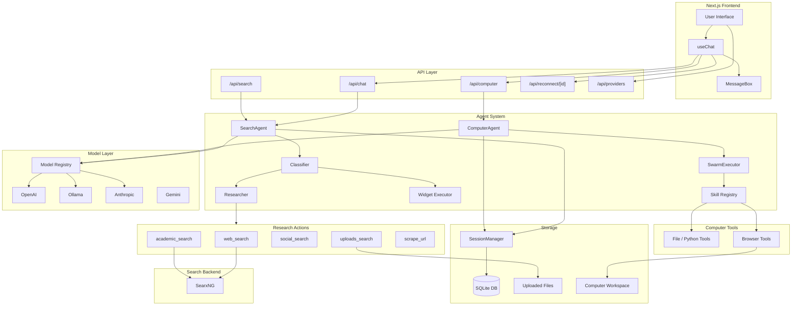

# Perplexica Architecture

Perplexica is a Next.js application that combines an AI chat experience with search and computer-agent execution.

For a high level flow, see [WORKING.md](WORKING.md). For deeper implementation details, see [CONTRIBUTING.md](../../CONTRIBUTING.md).

Focused subsystem docs:

- [Retrieval](./retrieval.md)
- [Agent Orchestration](./agent-orchestration.md)
- [Tool Execution](./tool-execution.md)
- [Safety Boundaries](./safety-boundaries.md)

## System Overview

## Key components

1. **User Interface**

   - A web based UI that lets users chat, search, and view citations.

2. **API Routes**

   - `POST /api/chat` powers the chat UI.
   - `POST /api/computer` powers the computer-agent UI mode.
   - `POST /api/search` provides a programmatic search endpoint.
   - `POST /api/reconnect/[id]` resumes in-flight streamed sessions.
   - `GET /api/providers` lists available providers and model keys.

3. **Agents and Orchestration**

   - The system classifies the question first.
   - It can run research and widgets in parallel.
   - It generates the final answer and includes citations.
   - Computer mode runs file, Python, and browser tools through `ComputerAgent` and `SwarmExecutor`.

4. **Search Backend**

   - A meta search backend is used to fetch relevant web results when research is enabled.

5. **LLMs (Large Language Models)**

   - Used for classification, writing answers, and producing citations.

6. **Embedding Models**

   - Used for semantic search over user uploaded files.

7. **Storage**
   - Chats and messages are stored so conversations can be reloaded.
   - Computer-mode browser artifacts are stored in the workspace on disk.
