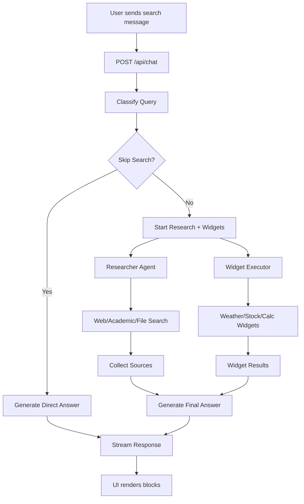
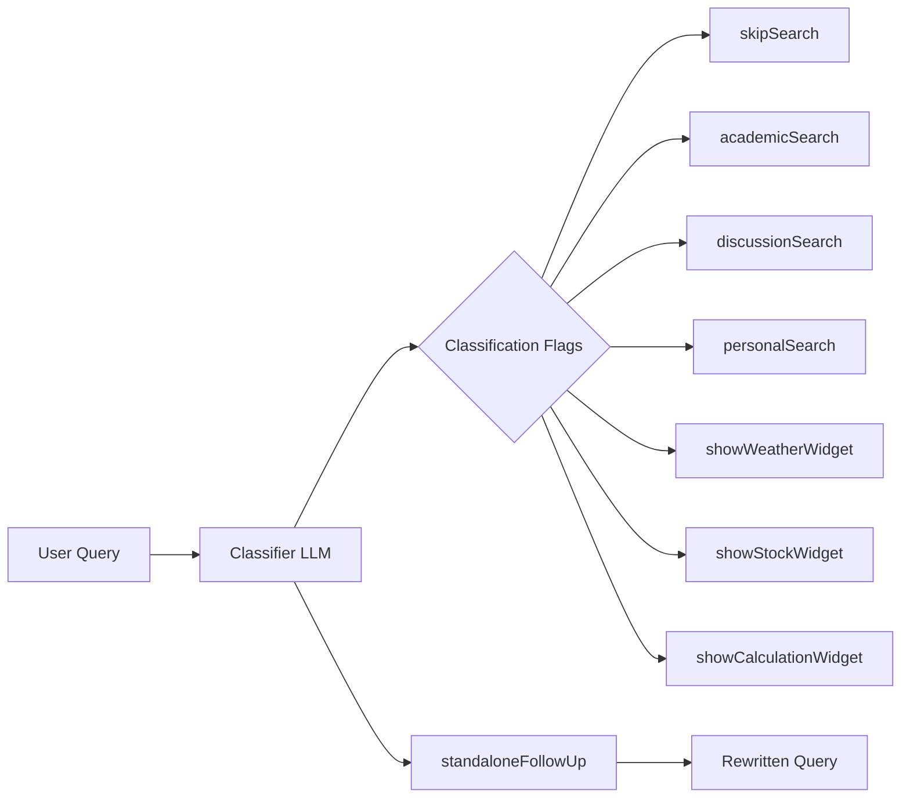
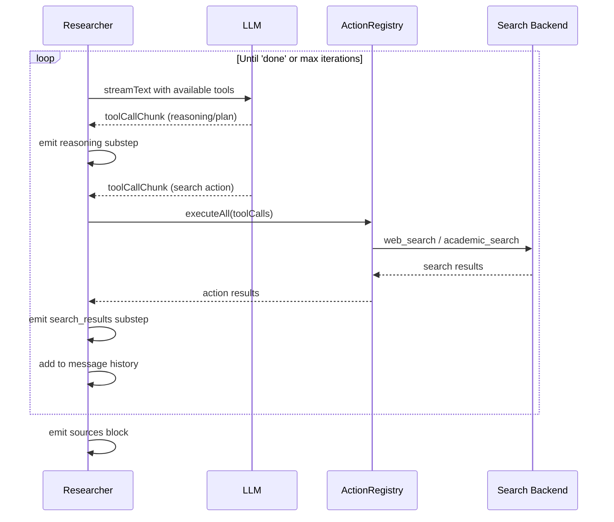
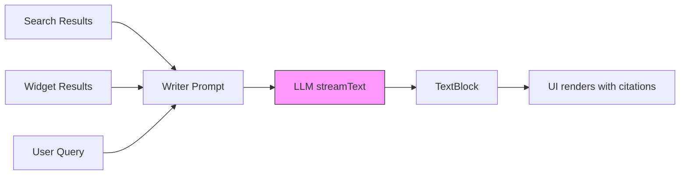

# How Search Mode Works

This is a high level overview of how Perplexica answers a question in search mode.

If you want a component level overview, see [README.md](README.md).

If you want implementation details, see [CONTRIBUTING.md](../../CONTRIBUTING.md).

Computer mode uses the same session, persistence, and block-rendering infrastructure, but it routes through `POST /api/computer` and is documented separately in [`enhance.md`](../../enhance.md).

## What happens when you ask a question

When you send a message in the UI while search mode is selected, the app calls `POST /api/chat`.

At a high level, search mode does three things:

1. Classify the question and decide what to do next.
2. Run research and widgets in parallel.
3. Write the final answer and include citations.

## Classification

Before searching or answering, we run a classification step.

This step decides things like:

- Whether we should do research for this question
- Whether we should show any widgets
- How to rewrite the question into a clearer standalone form

## Widgets

Widgets are small, structured helpers that can run alongside research.

Examples include weather, stocks, and simple calculations.

If a widget is relevant, we show it in the UI while the answer is still being generated.

Widgets are helpful context for the answer, but they are not part of what the model should cite.

## Research

If research is needed, we gather information in the background while widgets can run.

Depending on configuration, research may include web lookup and searching user uploaded files.

## Answer generation

Once we have enough context, the chat model generates the final response.

You can control the tradeoff between speed and quality using `optimizationMode`:

- `speed`
- `balanced`
- `quality`

## How citations work

We prompt the model to cite the references it used. The UI then renders those citations alongside the supporting links.

## Search API

If you are integrating Perplexica into another product, you can call `POST /api/search`.

It returns:

- `message`: the generated answer
- `sources`: supporting references used for the answer

You can also enable streaming by setting `stream: true`.

## Image and video search

Image and video search use separate endpoints (`POST /api/images` and `POST /api/videos`). We generate a focused query using the chat model, then fetch matching results from a search backend.
