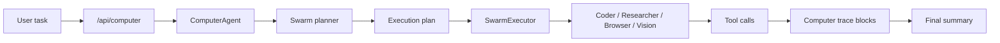

# Agent Orchestration

## Flow

1. `ComputerAgent` persists the request and creates a computer trace block.
2. The planner builds a minimal multi-agent plan or falls back to a single operator when swarm planning is disabled or fails.
3. `SwarmExecutor` runs each sub-agent sequentially, preserving shared history and emitting action and observation steps.
4. The summary stage writes a user-facing completion message grounded in the trace outcome.

## Reliability hooks

- JSON-repair retries for planning
- Per-skill tool constraints
- Iteration limits by optimization mode
- Failure classification for benchmark aggregation and operator recovery
