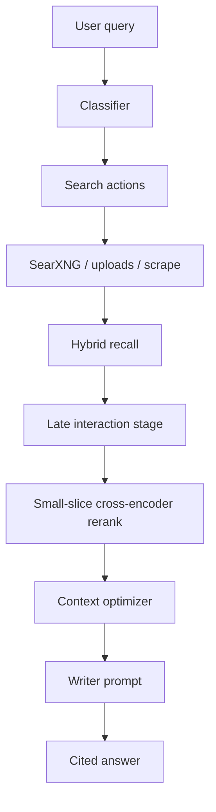

# Retrieval Architecture

## Stages

1. Query classification decides whether retrieval should run and which sources are enabled.
2. Search actions collect raw chunks from web, academic, discussion, upload, or explicit URL sources.
3. Post-processing keeps BM25 or hybrid retrieval as the broad-recall stage.
4. Late interaction rescoring refines only the candidate set, and a cross-encoder-style score is applied only to a very small head slice.
5. Context optimization performs sentence extraction, MMR-style diversity, and token-budget-aware packing before the writer sees the evidence.

## Current signals

- BM25-style lexical score
- Vector similarity when an embedding model is configured
- Cross-encoder proxy score for pairwise query-passage relevance
- Source authority and freshness
- Chunk density and citation overlap penalties
- Optional prior success or click priors from metadata when available
