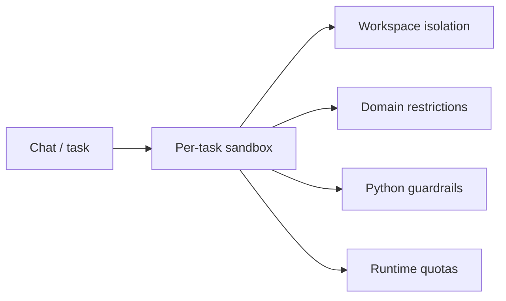

# Safety Boundaries

## Isolation

- Each computer task receives its own workspace under `data/computer-workspaces/<chatId>/<messageId>`.
- Browser contexts are keyed to the sandbox id instead of sharing a global page across chats.

## Permissions

- File tools are restricted to the sandbox root.
- Browser navigation is limited to `http` and `https`, can enforce an allowlist, and denies private or loopback hosts by default.
- Python blocks subprocesses and disables network access unless explicitly re-enabled by environment policy.

## Quotas

- Max file bytes
- Max workspace bytes
- Max file count
- Max Python runtime and output size
- Max browser actions per task

## Security model

The sandbox is an application-layer containment model, not an OS-level jail. It reduces accidental or prompt-induced misuse, contains artifacts per task, and makes policy visible and benchmarkable. For stronger guarantees, pair it with container- or VM-level isolation.
