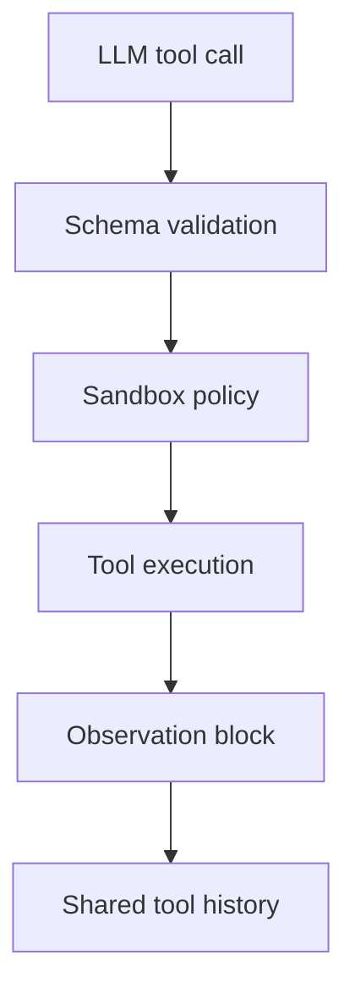

# Tool Execution

## Execution path

1. Tool calls are validated against Zod schemas.
2. The sandbox context enforces workspace, domain, quota, and runtime rules.
3. The selected tool runs with only the arguments and permissions available to that skill.
4. Results are appended back into the shared conversation so later sub-agents see the actual outcome rather than inferred state.

## Safety checkpoints

- Workspace path resolution
- Browser URL allowlist and private-network denial
- Python network and subprocess blocking
- File-size, workspace-size, file-count, and browser-action quotas
