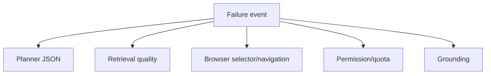

# Failure Taxonomy

## Common breakpoints

### Planner JSON

- Breaks when small models return malformed tool plans.
- Recovery: JSON repair, lower temperature, fallback operator mode.

### Retrieval quality

- Breaks when sources are empty, weak, duplicated, or conflicting.
- Recovery: broaden the query, use higher-confidence chunks, hedge unsupported claims.

### Browser selectors

- Breaks when page structure changes or the plan assumes stale selectors.
- Recovery: capture a screenshot, re-scrape, or hand off to the vision step.

### Sandbox permissions

- Breaks when tools request paths outside the workspace, private-network URLs, blocked Python imports, or quota overruns.
- Recovery: tighten scope, keep work in the sandbox, or explicitly relax policy.

### Writer grounding

- Breaks when context is overstuffed or low-confidence evidence dominates.
- Recovery: regenerate from a smaller, higher-quality packed context.

## Live benchmark usage

The live agent benchmark maps error messages to these classes so success-rate regressions can be broken down by failure mode rather than only raw pass/fail counts.
