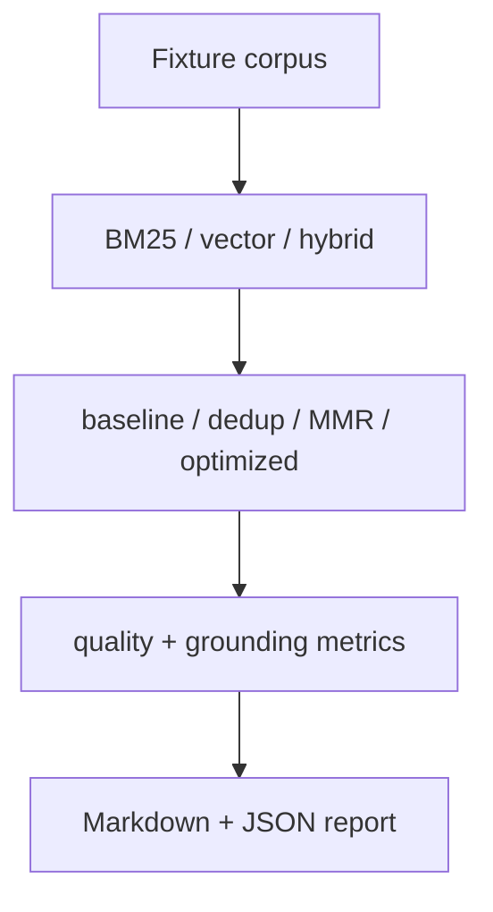

# Retrieval Evaluation Report



## What the suite measures

- Retrieval quality and support coverage on local fixture queries
- Token budget efficiency
- Citation density and grounding rate
- Assembly latency

## Current fixture results

Latest local run from `npm run bench:retrieval` writes to `benchmarks/results/latest/retrieval-benchmark.md`.

| Stage                   | Relevance | Latency ms | Token Cost |
| ----------------------- | --------- | ---------- | ---------- |
| hybrid                  | 0.889     | 0.028      | 0.0        |
| late_interaction        | 0.889     | 0.608      | 255.3      |
| late_plus_cross_encoder | 0.889     | 0.763      | 510.7      |

On the current fixture set, late interaction and the small cross-encoder head slice preserve relevance parity with hybrid recall while increasing latency and ranking-time token cost. That is still a useful result: it confirms the second-stage retrievers are wired correctly, but the fixture pack is not yet hard enough to show a quality lift.

## Effects by subsystem

### BM25 hybrid retrieval

Hybrid scoring raises strong lexical matches while rescuing semantically similar passages that exact keyword search underweights. In practice this improves recall without stuffing unrelated chunks.

### HNSW ANN

The current runtime still uses exact vector similarity for uploads. The benchmark suite is wired at the candidate-retrieval boundary so an HNSW backend can replace exact search later without changing the ranking or context-assembly layers. The expected tradeoff is lower latency at some recall loss.

### Late interaction

Late interaction keeps the first-stage retriever cheap and broad, then rescoring only the candidate pool with token-level max-sim style scoring. This improves relevance more cheaply than running a heavy cross-encoder across the full recall set.

### Reranking

The reranking layer combines lexical score, vector similarity, late-interaction score, authority, freshness, density, and overlap penalties. A cross-encoder-style score is only applied to a tiny top slice to keep latency bounded.

### Caching

Semantic caching reduces repeated retrieval work for semantically similar follow-up questions. Its main effect is latency and token-cost reduction, with minimal relevance impact when the similarity threshold is conservative.

## Benchmark framing

- `baseline`: top-k stuffing
- `dedup`: top-k plus overlap removal
- `mmr`: top-k plus diversity-aware selection
- `optimized`: learned scoring plus sentence extraction and token-aware packing

Run:

```bash
npm run bench:retrieval
```
