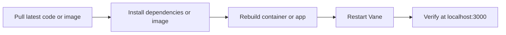

# Update Vane to the latest version

To update Vane to the latest version, follow these steps:



The bundled full Docker image pins the embedded SearXNG checkout to a
specific upstream commit for reproducible builds. When you intentionally
update SearXNG, review `ARG SEARXNG_COMMIT` in
`Dockerfile` and test the bundled search path before shipping.

## For Docker users (Using pre-built images)

Simply pull the latest image and restart your container:

```bash
docker pull itzcrazykns1337/vane:latest
docker stop vane
docker rm vane
docker run -d -p 3000:3000 -v vane-data:/home/vane/data --name vane itzcrazykns1337/vane:latest
```

For slim version:

```bash
docker pull itzcrazykns1337/vane:slim-latest
docker stop vane
docker rm vane
docker run -d -p 3000:3000 -e SEARXNG_API_URL=http://your-searxng-url:8080 -v vane-data:/home/vane/data --name vane itzcrazykns1337/vane:slim-latest
```

Once updated, go to http://localhost:3000 and verify the latest changes. Your settings are preserved automatically.

## For Docker users (Building from source)

1. Navigate to your Vane directory and pull the latest changes:

   ```bash
   cd Vane
   git pull origin master
   ```

2. Rebuild the Docker image:

   ```bash
   docker build -t vane .
   ```

3. Stop and remove the old container, then start the new one:

   ```bash
   docker stop vane
   docker rm vane
   docker run -p 3000:3000 -p 8080:8080 --name vane vane
   ```

4. Once the command completes, go to http://localhost:3000 and verify the latest changes.

## For non-Docker users

1. Navigate to your Vane directory and pull the latest changes:

   ```bash
   cd Vane
   git pull origin master
   ```

2. Install any new dependencies:

   ```bash
   npm i
   ```

3. Rebuild the application:

   ```bash
   npm run build
   ```

4. Restart the application:

   ```bash
   npm run start
   ```

5. Go to http://localhost:3000 and verify the latest changes. Your settings are preserved automatically.

---
