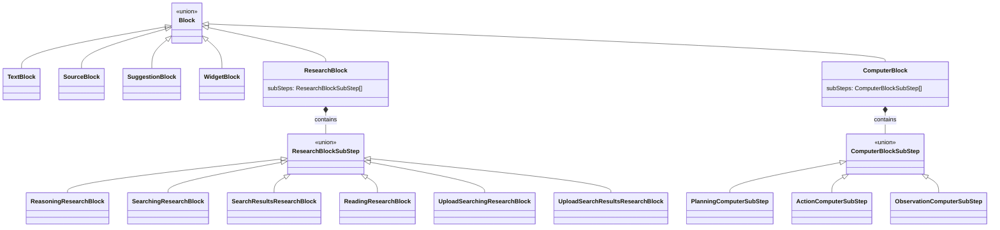
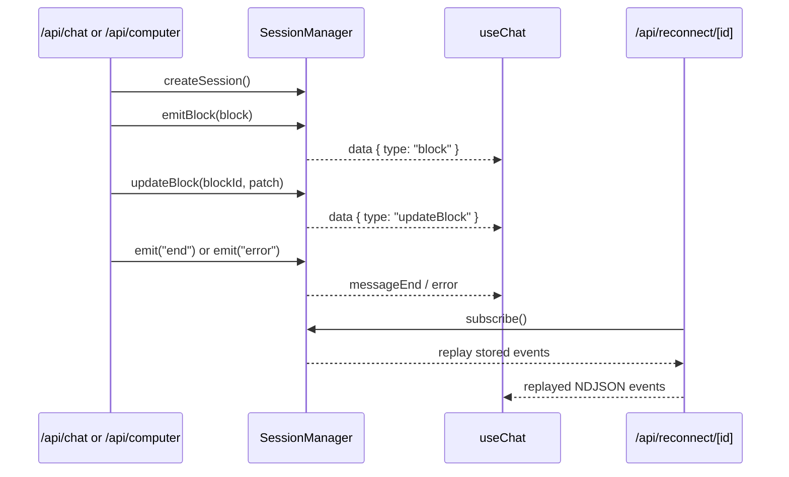
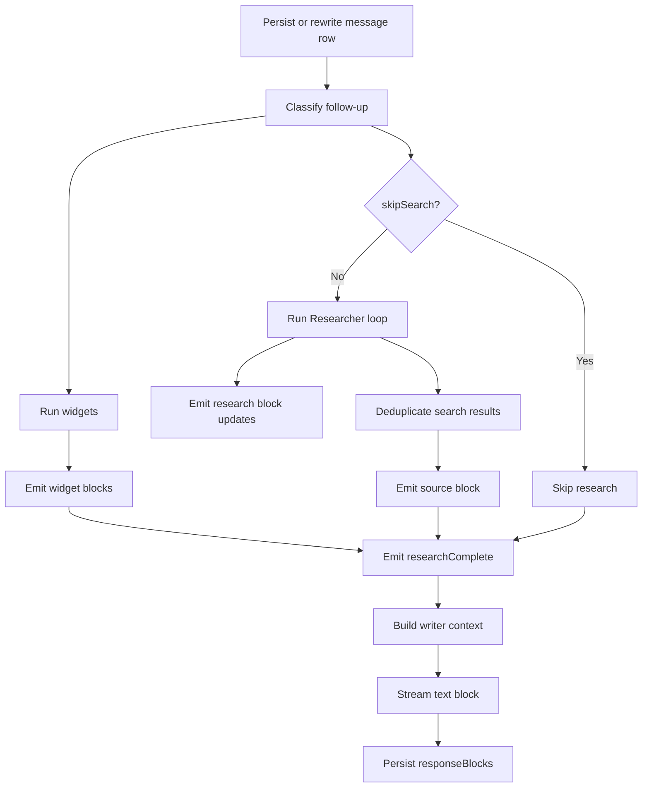
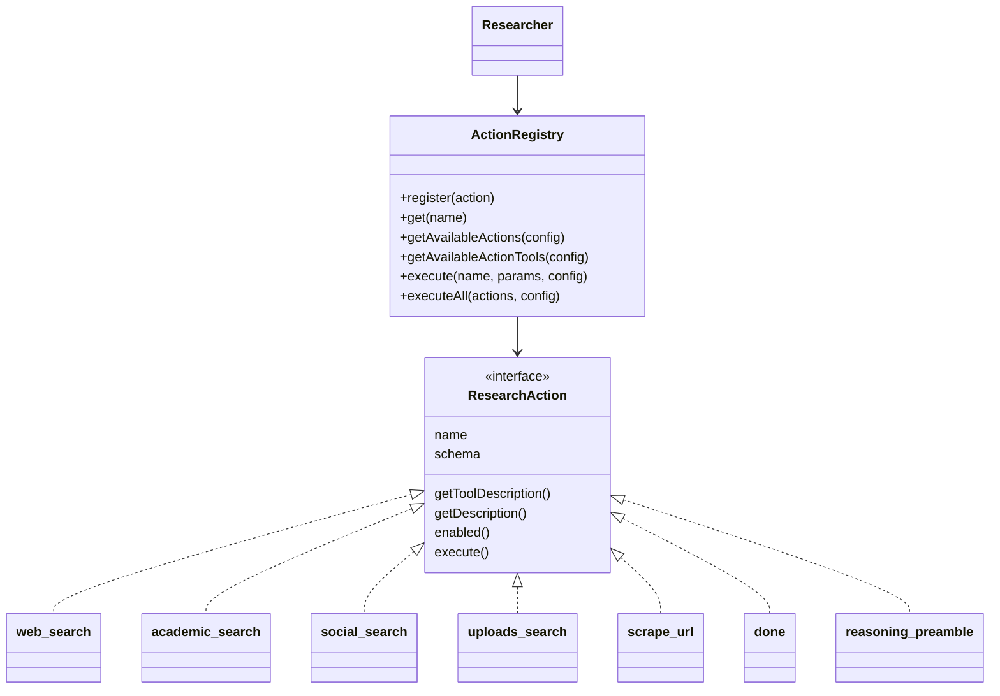

# Computer Mode: As-Built Architecture

## Summary
Computer mode is implemented as a first-class extension of the existing Perplexica chat and search architecture. It reuses the same persisted message model, `Block` streaming contract, session reconnect flow, and `useChat` message pipeline that search mode already uses.

This document reflects the repository as it exists now, including validation fixes added during the implementation pass:

- shared NDJSON stream parsing in `src/lib/hooks/useChat.tsx`
- rewrite history slicing in `src/lib/hooks/useChat.tsx`
- immutable event snapshots in `src/lib/session.ts`
- reconnect replay safety in `src/app/api/reconnect/[id]/route.ts`
- clearer computer tool and skill prompts for required arguments

## What Was Implemented

### New backend path
- `POST /api/computer` in `src/app/api/computer/route.ts`
- request validation with Zod
- streamed newline-delimited JSON events using the same `SessionManager` contract as `/api/chat`
- persisted message lifecycle in the `messages` table

### New computer agent stack
- `ComputerAgent` in `src/lib/agents/computer/index.ts`
- prompts in `src/lib/agents/computer/prompts.ts`
- workspace-scoped file and Python tools in `src/lib/agents/computer/tools.ts`
- Playwright browser tools in `src/lib/agents/computer/skills/browserSkill.ts`
- skill registry in `src/lib/agents/computer/skills/registry.ts`
- sequential multi-agent execution and final summarization in `src/lib/agents/computer/swarmExecutor.ts`

### New UI surface
- interaction mode selection in `src/components/MessageInputActions/InteractionMode.tsx`
- swarm toggle in `src/components/MessageInputActions/SwarmToggle.tsx`
- empty-chat and in-chat composer wiring in:
  - `src/components/EmptyChatMessageInput.tsx`
  - `src/components/MessageInput.tsx`
- computer trace rendering in `src/components/ComputerSteps.tsx`
- mixed block rendering in `src/components/MessageBox.tsx`

### Shared type and state updates
- `ComputerBlock` added to the `Block` union in `src/lib/types.ts`
- `interactionMode` and `swarmEnabled` added to the chat context in `src/lib/hooks/useChat.tsx`
- local persistence for mode/toggle state via `localStorage`

### Artifact model
- browser screenshots are stored as files under `<workspace>/browser-artifacts/`
- stored messages keep file paths and textual summaries, not inline base64 screenshots

## End-to-End Request Flow

### Composer to endpoint selection
1. `useChat` tracks `interactionMode` as `'search' | 'computer'`.
2. `MessageInput` and `EmptyChatMessageInput` expose the mode selector and swarm toggle.
3. `sendMessage()` in `src/lib/hooks/useChat.tsx` routes to:
   - `/api/chat` when `interactionMode === 'search'`
   - `/api/computer` when `interactionMode === 'computer'`

### Computer request handling
1. `src/app/api/computer/route.ts` validates the request body.
2. The route loads the selected chat model through `ModelRegistry`.
3. A `SessionManager` instance is created for live streaming and reconnect.
4. `ComputerAgent.executeAsync()`:
   - inserts or rewrites the current `messages` row
   - emits an initial `computer` block
   - creates a swarm plan when `swarmEnabled` is true, otherwise creates a single `operator` plan
   - executes agents sequentially through `SwarmExecutor`
   - streams the final text summary
   - persists `session.getAllBlocks()` into the message row

### Frontend stream handling
1. `useChat` consumes newline-delimited JSON via `parseNdjsonStream()`.
2. Stream events update the current in-memory message:
   - `block`
   - `updateBlock`
   - `researchComplete`
   - `messageEnd`
   - `error`
3. `sections` are derived from persisted/streamed `responseBlocks`.
4. `MessageBox` renders:
   - sources
   - research steps
   - computer steps
   - widgets
   - final markdown answer

### Persistence and reconnect
1. Each persisted `messages` row stores:
   - `backendId`
   - `status`
   - `responseBlocks`
2. `POST /api/reconnect/[id]` replays in-memory session events for in-flight messages.
3. Reloaded chats hydrate from `GET /api/chats/[id]` and render through the same `MessageBox` pipeline.

## Backend Architecture

### Route contract
`src/app/api/computer/route.ts` accepts:

- `message`
- `optimizationMode`
- `swarmEnabled`
- `history`
- `chatModel`
- `systemInstructions`

It returns streamed NDJSON events over a `text/event-stream` response:

- `{"type":"block","block":...}`
- `{"type":"updateBlock","blockId":...,"patch":[...]}`
- `{"type":"messageEnd"}`
- `{"type":"error","data":"..."}`

### Agent execution
`ComputerAgent` is responsible for persistence and session ownership. `SwarmExecutor` is responsible for:

- swarm plan generation
- skill-specific model resolution
- tool-call execution
- action/observation substep emission
- final user-facing summary streaming

Execution is sequential, not parallel. Each agent appends to a shared tool/message history and emits updates into a single `computer` block.

### Tool system
The computer tool contract lives in `src/lib/agents/computer/types.ts` and uses Zod schemas through the shared `Tool` interface.

Implemented tools:

- file tools:
  - `read_file`
  - `write_file`
  - `list_files`
- Python tool:
  - `execute_python`
- browser tools:
  - `browser_navigate`
  - `browser_click`
  - `browser_type`
  - `browser_screenshot`
  - `browser_scrape`

### Workspace and safety model
- workspace root defaults to `process.cwd()`
- `COMPUTER_WORKSPACE_DIR` can override the workspace root
- file tools reject path traversal through `resolveWorkspacePath()`
- Python executes with `cwd` set to the workspace root
- browser artifacts are written under the workspace

### Skill model
`src/lib/agents/computer/skills/registry.ts` defines:

- `planner`
- `operator`
- `coder`
- `researcher`
- `browser`

The important behavior is:

- `operator` is the single-agent fallback and has access to all computer tools
- `coder`, `researcher`, and `browser` constrain the tool set for swarm plans
- `planner` is used only for structured swarm planning

### Error handling
- tool validation failures are turned into `observation` steps instead of crashing the session
- terminal execution failures emit `session.emit('error', ...)`
- persisted messages are marked `error` when execution fails before completion

## Frontend Architecture

### State and persistence
`src/lib/hooks/useChat.tsx` now owns:

- `interactionMode`
- `swarmEnabled`
- shared NDJSON parsing for search and computer streams

Both mode values persist in `localStorage` and survive reloads.

### Composer behavior
- search mode keeps source selection, uploads, and search-centric placeholders
- computer mode swaps the placeholder copy and shows the swarm toggle
- the attach/source controls are suppressed in computer mode

### Rendering behavior
`src/components/MessageBox.tsx` now branches by block type:

- `research` blocks render through `AssistantSteps`
- `computer` blocks render through `ComputerSteps`
- search-only media sidebars are hidden for computer messages

### Computer trace component
`src/components/ComputerSteps.tsx` renders:

- planning steps
- action steps with running/completed/error status
- observation steps with success/error styling

The component auto-expands while the latest computer message is still answering and collapses on completion.

## Integration With Existing Search Architecture
Computer mode is not a separate chat system. It is an additional execution mode layered onto the existing one.

### Shared infrastructure
- `SessionManager` in `src/lib/session.ts`
- persisted `messages` / `chats` schema in `src/lib/db/schema.ts`
- reconnect endpoint in `src/app/api/reconnect/[id]/route.ts`
- `useChat` request/stream/history pipeline in `src/lib/hooks/useChat.tsx`
- `MessageBox` block renderer in `src/components/MessageBox.tsx`

### Computer-specific pieces
- `POST /api/computer`
- `ComputerAgent`
- computer tools and skills
- `ComputerBlock` rendering

### Validation fixes made in shared infrastructure
- stream parsing now preserves partial NDJSON lines without replaying already-processed events
- rewrite history now slices by turn pairs instead of raw message index
- session event history is snapshotted to avoid reconnect replay corruption
- reconnect subscription no longer closes over an uninitialized unsubscribe reference

## Differences From the Original Proposal
- Tool definitions use Zod schemas through the shared model interface rather than ad hoc JSON schema objects.
- The workspace root is dynamic and environment-overridable rather than hardcoded to a single Docker path.
- Browser screenshots are persisted as files in the workspace rather than base64 payloads in stored chat rows.
- Single-agent execution uses an explicit `operator` skill with access to every computer tool.
- Swarm planning uses `generateObject()` with a Zod schema instead of parsing free-form JSON text manually.
- Validation required additional shared-chat fixes that were not captured in the original draft:
  - NDJSON parsing
  - rewrite history slicing
  - session event snapshotting
  - reconnect unsubscribe safety

## Verification Status

### Checks that passed
- `npm run lint`
- `npx next typegen`
- `npx tsc --noEmit --pretty false`
- `npm run build`
- `docker build -f Dockerfile .`
- `docker build -f Dockerfile.slim .`

### Runtime scenarios verified
- `POST /api/chat` live SearXNG-backed search-mode smoke request with `sources: ['web']`
- `POST /api/computer` single-agent workspace listing
- `POST /api/computer` single-agent file creation
- `POST /api/computer` browser navigation + screenshot artifact flow
- `POST /api/computer` swarm-enabled browser flow through the swarm code path, with planner fallback to `operator`
- `POST /api/reconnect/[id]` replay during an in-flight computer task after the session/reconnect fixes
- `node .next/standalone/server.js` startup after `npm run build` copied runtime assets into `.next/standalone/`
- browser artifact persistence to:
- `<workspace>/browser-artifacts/`
- UI smoke on the running app:
  - switch Search -> Computer
  - confirm swarm toggle visibility
  - send a computer task
  - render `Computer Steps`
  - reload hydrated chat history successfully

### Validation environment notes
- Validation used the repo's current Node-based toolchain and local dependency tree.
- Live search regression ran against a local SearXNG instance exposed at `http://localhost:8081`.
- The local Ollama provider used `qwen3.5:9b` for both chat and embeddings during the smoke tests.

### Verification blockers or partial coverage
- No remaining blockers for the core computer-mode and shared chat/search integration checks.
- Swarm planning remains model-sensitive on smaller local Ollama models, but the fallback path was exercised and works as intended.

## Known Gaps and Follow-Ups
- Natural-language swarm planning on the local Ollama model (`qwen3.5:9b`) can still fail to produce valid planner JSON, which triggers the intended fallback to a single `operator`. The swarm path is wired correctly, but the planner is model-sensitive.
- Natural-language browser tasks are less reliable on that local model than explicit tool-oriented prompts. Browser tooling itself is functioning; the remaining variability is model output quality.
- Standalone execution depends on running `npm run build` so `scripts/postbuild.js` can copy `drizzle/` and `data/` into `.next/standalone/`.

## Appendix: Existing Search Architecture Reference

### Block System & Message Types
Block types are defined in `src/lib/types.ts`.



- `text`
- `source`
- `suggestion`
- `widget`
- `research`
- `computer`

`research` substeps:

- `reasoning`
- `searching`
- `search_results`
- `reading`
- `upload_searching`
- `upload_search_results`

`computer` substeps:

- `planning`
- `action`
- `observation`

Persisted messages in `src/lib/db/schema.ts` store:

- `messageId`
- `chatId`
- `backendId`
- `query`
- `createdAt`
- `responseBlocks`
- `status`

### SessionManager & Streaming
`src/lib/session.ts` is the live event bus for both search and computer mode.



Important methods:

- `emitBlock(block)`
- `updateBlock(blockId, patch)`
- `subscribe(listener)`
- `getAllBlocks()`
- `getBlock(blockId)`

Live event shapes consumed by the frontend:

- `data -> { type: 'block', block }`
- `data -> { type: 'updateBlock', blockId, patch }`
- `data -> { type: 'researchComplete' }`
- `end -> messageEnd`
- `error -> error`

Important implementation detail:

- event payloads are now snapshotted before being stored in replay history, so reconnect sees the original event order without mutated object references

### Search Pipeline Flow
The persisted chat path is implemented in `src/lib/agents/search/index.ts`.



Flow:

1. persist or rewrite the current `messages` row
2. classify the query in `src/lib/agents/search/classifier.ts`
3. execute widgets in parallel through `WidgetExecutor.executeAll(...)`
4. run `Researcher.research(...)` unless `skipSearch === true`
5. emit `researchComplete`
6. build writer context from:
   - deduped search findings
   - widget `llmContext`
7. stream the final answer text into a `text` block
8. persist `session.getAllBlocks()` to the message row

`Researcher.research(...)` in `src/lib/agents/search/researcher/index.ts`:

1. emits an empty `research` block
2. computes available tools from `ActionRegistry`
3. runs an iterative tool-calling loop
4. updates `research` substeps as actions progress
5. deduplicates `search_results`
6. emits a final `source` block

The public API variant in `src/lib/agents/search/api.ts` follows the same classify -> widgets -> research -> writer structure, but streams `response` and `searchResults` events instead of persisted blocks.

### Action Registry System
Action registry implementation:

- `src/lib/agents/search/researcher/actions/registry.ts`
- `src/lib/agents/search/researcher/actions/index.ts`



Available registered actions:

- `web_search`
- `done`
- `__reasoning_preamble`
- `scrape_url`
- `uploads_search`
- `academic_search`
- `social_search`

Registry responsibilities:

- register actions
- compute enabled actions for the current query/config
- expose LLM tool definitions
- execute one or many actions

Each `ResearchAction` supplies:

- `name`
- `schema`
- `getToolDescription()`
- `getDescription()`
- `enabled()`
- `execute()`

### Model Provider System
Provider registration lives in `src/lib/models/providers/index.ts`.

```mermaid
flowchart LR
    Config[Configured providers<br/>config/serverRegistry.ts] --> Registry[ModelRegistry]
    ProviderMap[providers map<br/>models/providers/index.ts] --> Registry
    Registry --> Active[activeProviders[]]
    Active --> Chat[loadChatModel()]
    Active --> Embedding[loadEmbeddingModel()]
    Active --> List[getActiveProviders()]
    ProviderMap --> OpenAI[openai]
    ProviderMap --> Ollama[ollama]
    ProviderMap --> Gemini[gemini]
    ProviderMap --> Anthropic[anthropic]
    ProviderMap --> Other[groq / transformers / lemonade / lmstudio]
```

Current providers map:

- `openai`
- `ollama`
- `gemini`
- `transformers`
- `groq`
- `lemonade`
- `anthropic`
- `lmstudio`

`ModelRegistry` in `src/lib/models/registry.ts`:

- loads configured providers from `src/lib/config/serverRegistry.ts`
- instantiates provider classes
- exposes `getActiveProviders()`
- exposes `loadChatModel()` and `loadEmbeddingModel()`

### Prompt Architecture
Search prompts live in `src/lib/prompts/search/`.

- `classifier.ts` exports `classifierPrompt`
- `researcher.ts` exports `getResearcherPrompt(...)`
- `writer.ts` exports `getWriterPrompt(...)`

Computer prompts live in `src/lib/agents/computer/prompts.ts`.

- `withSystemInstructions(...)`
- `getComputerTaskContext(...)`
- `getSwarmPlanningPrompt(...)`
- `getComputerSummaryPrompt(...)`

The current pattern is function-based prompt composition rather than large static prompt files with embedded branching logic.

### Frontend Block Rendering
Core render path:

- `useChat` builds `sections` from stored/streamed `responseBlocks`
- `MessageBox` renders block-specific UI

Current block rendering behavior in `src/components/MessageBox.tsx`:

- `source` -> `MessageSources`
- `research` -> `AssistantSteps`
- `computer` -> `ComputerSteps`
- `widget` -> `Renderer`
- `text` -> markdown renderer
- search-only image/video sidebars render only when the message is not a computer message

### API Endpoints
Search and chat relevant endpoints:

| Endpoint | Purpose |
| --- | --- |
| `POST /api/chat` | persisted streamed search/chat flow used by the main UI |
| `POST /api/computer` | persisted streamed computer-agent flow |
| `POST /api/reconnect/[id]` | reconnect to an in-flight `SessionManager` stream |
| `GET /api/chats/[id]` | load a persisted chat and all messages |
| `DELETE /api/chats/[id]` | delete a persisted chat |
| `POST /api/search` | public search API variant with optional streaming and no chat persistence |
| `GET /api/providers` | load configured model providers for the UI |
| `GET /api/config` | load app config and provider metadata |
| `POST /api/config/setup-complete` | mark setup as complete |
| `GET /api/discover` | discover-page feed backed by SearXNG |

### Search Result Deduplication
Search deduplication happens in `src/lib/agents/search/researcher/index.ts`.

Algorithm:

1. gather all action outputs of type `search_results`
2. index by `result.metadata.url`
3. keep the first result for a URL
4. append duplicate result content onto the first result
5. filter the duplicates out of the final emitted `source` block

### Key Files Reference
| File | Responsibility |
| --- | --- |
| `src/lib/session.ts` | shared in-memory event bus and replay store |
| `src/lib/types.ts` | block/message type system |
| `src/lib/hooks/useChat.tsx` | frontend request, stream, history, and mode state |
| `src/components/MessageBox.tsx` | mixed block renderer |
| `src/app/api/chat/route.ts` | persisted search/chat route |
| `src/lib/agents/search/index.ts` | persisted search pipeline |
| `src/lib/agents/search/researcher/index.ts` | research loop and source emission |
| `src/lib/agents/search/researcher/actions/registry.ts` | search action registration and execution |
| `src/lib/models/registry.ts` | configured provider loading |
| `src/app/api/computer/route.ts` | persisted computer route |
| `src/lib/agents/computer/index.ts` | computer-agent persistence and session lifecycle |
| `src/lib/agents/computer/swarmExecutor.ts` | planning, sub-agent execution, final summary |
| `src/lib/agents/computer/tools.ts` | file and Python tools |
| `src/lib/agents/computer/skills/browserSkill.ts` | Playwright browser tools |
| `src/components/ComputerSteps.tsx` | computer trace renderer |

### Pattern Summary

#### Adding a new search research tool
1. Create a `ResearchAction` in `src/lib/agents/search/researcher/actions/`.
2. Implement `schema`, descriptions, enablement, and `execute()`.
3. Register it in `src/lib/agents/search/researcher/actions/index.ts`.
4. Update any emitted research substep patches if the action needs custom progress UI.
5. If it produces citations, return `search_results` chunks so the writer can cite them.

#### Adding a new widget
1. Implement a `Widget` in the search widgets folder.
2. Register it with the widget executor.
3. Return:
   - `type`
   - `data` for UI rendering
   - `llmContext` for the writer
4. `SearchAgent` will emit a `widget` block automatically when the executor returns output.

#### Adding a new computer tool or skill
1. Define a `ComputerTool` with a Zod schema.
2. Register it through the computer skill registry.
3. Attach it only to the skills that should be allowed to call it.
4. If the tool changes trace semantics, update `ComputerSteps.tsx` and `ComputerBlockSubStep` accordingly.

#### Extending the shared block system
1. Add the block type to `src/lib/types.ts`.
2. Ensure it serializes cleanly through the `messages.responseBlocks` JSON column.
3. Teach `MessageBox` and any dedicated renderer component how to display it.
4. Confirm reconnect replay and `useChat` stream handling accept the new block shape.
