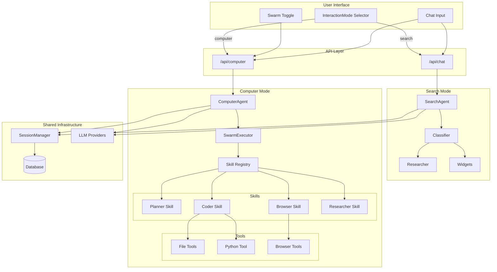
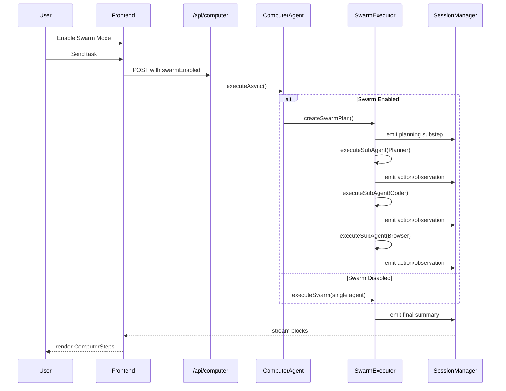

Computer Agent Mode Implementation Plan (CoPaw-Enhanced)
Context
Perplexica currently operates exclusively as a search-focused AI assistant. This enhancement adds a Computer Agent Mode with CoPaw-inspired real sub-agent orchestration, enabling users to execute complex tasks using file operations, Python code execution, and browser automation.

Why this change is needed:

Enable local task execution beyond web search (file ops, code execution, browser automation)
Implement real sub-agents (not just virtual roles) using CoPaw's skill registry pattern
Support Playwright browser automation for web scraping and testing
Provide intelligent task decomposition with specialized sub-agents (Planner, Coder, Researcher, Browser)
Maintain full compatibility with existing search mode and database schema
Optimize for M4 MacBook Pro 24GB (sequential execution, one model at a time)
Key Design Principles:

Reuse existing DB schema (messages.responseBlocks stores Block[])
Follow SearchAgent patterns exactly (SessionManager, block emission, status lifecycle)
Add new /api/computer endpoint (clean separation from search)
CoPaw skill registry for modular, extensible capabilities
Real sub-agent orchestration (not prompt-based simulation)
Sequential execution to keep RAM under 16GB on M4
Store mode preference in localStorage
User has Qwen 3.5 9B installed via Ollama
CoPaw Integration Benefits:

Real sub-agents with specialized prompts and tool access
Modular skill system (easy to add new capabilities)
Better task planning and execution
Browser automation via Playwright (web scraping, testing, form filling)
Production-ready patterns from Alibaba's AgentScope framework
References:

CoPaw GitHub (Apache 2.0 license)
AgentScope Web Browser Control
CoPaw Skills Discussion
Implementation Overview

Files to Modify (4)
src/lib/types.ts - Add ComputerBlock types
src/lib/hooks/useChat.tsx - Add mode switching and routing
src/components/MessageBox.tsx - Render ComputerBlock
src/components/EmptyChatMessageInput.tsx - Add mode controls
Files to Create (11) - CoPaw-Enhanced
src/lib/agents/computer/types.ts - Type definitions
src/lib/agents/computer/tools.ts - File and Python tools
src/lib/agents/computer/prompts.ts - System prompts (CoPaw-style role prompts)
src/lib/agents/computer/index.ts - ComputerAgent class (uses swarm executor)
src/lib/agents/computer/skills/registry.ts - CoPaw skill registry ⭐
src/lib/agents/computer/skills/browserSkill.ts - Playwright browser automation ⭐
src/lib/agents/computer/swarmExecutor.ts - Real sub-agent orchestration ⭐
src/app/api/computer/route.ts - API endpoint
src/components/MessageInputActions/InteractionMode.tsx - Mode selector
src/components/MessageInputActions/SwarmToggle.tsx - Swarm toggle
src/components/ComputerSteps.tsx - ComputerBlock renderer
Detailed Implementation

1. Type Definitions
   File: src/lib/types.ts (MODIFY)

Add after line 116 (after ResearchBlock definition):

// Computer agent substep types
export type PlanningComputerSubStep = {
id: string;
type: 'planning';
plan: string;
agents?: Array<{ role: string; task: string }>;
};

export type ActionComputerSubStep = {
id: string;
type: 'action';
action: string;
tool: string;
status: 'running' | 'completed' | 'error';
};

export type ObservationComputerSubStep = {
id: string;
type: 'observation';
observation: string;
success: boolean;
};

export type ComputerBlockSubStep =
| PlanningComputerSubStep
| ActionComputerSubStep
| ObservationComputerSubStep;

export type ComputerBlock = {
id: string;
type: 'computer';
data: {
subSteps: ComputerBlockSubStep[];
};
};
Update Block union (line 118):

export type Block =
| TextBlock
| SourceBlock
| SuggestionBlock
| WidgetBlock
| ResearchBlock
| ComputerBlock; // ADD
Pattern: Mirrors ResearchBlock structure with substeps array.

1. Computer Agent Backend
   File: src/lib/agents/computer/types.ts (CREATE)

import { BaseLLM } from '@/lib/models/base/llm';
import { ChatTurnMessage } from '@/lib/types';

export type ComputerAgentConfig = {
llm: BaseLLM<any>;
mode: 'speed' | 'balanced' | 'quality';
swarmEnabled: boolean;
systemInstructions: string;
};

export type ComputerAgentInput = {
chatHistory: ChatTurnMessage[];
task: string;
chatId: string;
messageId: string;
config: ComputerAgentConfig;
};

export type FileToolResult = {
success: boolean;
content?: string;
error?: string;
};

export type PythonToolResult = {
success: boolean;
stdout?: string;
stderr?: string;
error?: string;
};
File: src/lib/agents/computer/tools.ts (CREATE)

import fs from 'fs/promises';
import path from 'path';
import { spawn } from 'child_process';
import { FileToolResult, PythonToolResult } from './types';

const WORKSPACE_BASE = '/home/perplexica/data/computer-workspace';

export const fileTools = {
read_file: {
name: 'read_file',
description: 'Read contents of a file in the workspace',
schema: {
type: 'object',
properties: {
filepath: { type: 'string', description: 'Relative path within workspace' },
},
required: ['filepath'],
},
execute: async (params: { filepath: string }): Promise<FileToolResult> => {
try {
const safePath = path.join(WORKSPACE_BASE, params.filepath);
if (!safePath.startsWith(WORKSPACE_BASE)) {
throw new Error('Path traversal detected');
}
const content = await fs.readFile(safePath, 'utf-8');
return { success: true, content };
} catch (error: any) {
return { success: false, error: error.message };
}
},
},

write_file: {
name: 'write_file',
description: 'Write content to a file in the workspace',
schema: {
type: 'object',
properties: {
filepath: { type: 'string' },
content: { type: 'string' },
},
required: ['filepath', 'content'],
},
execute: async (params: { filepath: string; content: string }): Promise<FileToolResult> => {
try {
const safePath = path.join(WORKSPACE_BASE, params.filepath);
if (!safePath.startsWith(WORKSPACE_BASE)) {
throw new Error('Path traversal detected');
}
await fs.mkdir(path.dirname(safePath), { recursive: true });
await fs.writeFile(safePath, params.content, 'utf-8');
return { success: true };
} catch (error: any) {
return { success: false, error: error.message };
}
},
},

list_files: {
name: 'list_files',
description: 'List files in workspace directory',
schema: {
type: 'object',
properties: {
directory: { type: 'string', description: 'Directory path (optional)' },
},
},
execute: async (params: { directory?: string }): Promise<FileToolResult> => {
try {
const targetDir = params.directory
? path.join(WORKSPACE_BASE, params.directory)
: WORKSPACE_BASE;

        if (!targetDir.startsWith(WORKSPACE_BASE)) {
          throw new Error('Path traversal detected');
        }

        await fs.mkdir(targetDir, { recursive: true });
        const files = await fs.readdir(targetDir);
        return { success: true, content: files.join('\n') };
      } catch (error: any) {
        return { success: false, error: error.message };
      }
    },

},
};

export const pythonTool = {
name: 'execute*python',
description: 'Execute Python code and return output',
schema: {
type: 'object',
properties: {
code: { type: 'string', description: 'Python code to execute' },
},
required: ['code'],
},
execute: async (params: { code: string }): Promise<PythonToolResult> => {
return new Promise((resolve) => {
const tempFile = path.join(WORKSPACE_BASE, `temp*${Date.now()}.py`);

      fs.mkdir(WORKSPACE_BASE, { recursive: true })
        .then(() => fs.writeFile(tempFile, params.code, 'utf-8'))
        .then(() => {
          const proc = spawn('python3', [tempFile], {
            cwd: WORKSPACE_BASE,
            timeout: 30000,
          });

          let stdout = '';
          let stderr = '';

          proc.stdout.on('data', (d) => (stdout += d.toString()));
          proc.stderr.on('data', (d) => (stderr += d.toString()));

          proc.on('close', (code) => {
            fs.unlink(tempFile).catch(() => {});
            if (code === 0) {
              resolve({ success: true, stdout, stderr });
            } else {
              resolve({ success: false, error: `Exit code ${code}`, stderr });
            }
          });

          proc.on('error', (err) => {
            fs.unlink(tempFile).catch(() => {});
            resolve({ success: false, error: err.message });
          });
        })
        .catch((err) => {
          resolve({ success: false, error: err.message });
        });
    });

},
};
Security: Path traversal protection, 30s timeout for Python, workspace isolation.

File: src/lib/agents/computer/skills/registry.ts (CREATE) - CoPaw Skill System ⭐

import { fileTools, pythonTool } from '../tools';
import { browserSkill } from './browserSkill';

export type Skill = {
name: string;
description: string;
role: string;
tools: string[];
systemPrompt: string;
model?: string; // Optional specific model (e.g., "qwen2.5-coder:14b" for coding)
};

export type SkillRegistry = Record<string, Skill>;

// CoPaw-inspired skill registry with specialized sub-agents
export const skillRegistry: SkillRegistry = {
planner: {
name: 'planner',
description: 'Plans and decomposes tasks into specialized sub-agent roles',
role: 'Task Planner',
tools: [],
systemPrompt: `You are a task planning specialist. Break down complex tasks into specialized roles.

For each task, identify:

1. What roles are needed (e.g., Coder, Researcher, Browser, DataAnalyst)
2. The sequence of execution
3. Dependencies between steps

Output JSON format:
{
"plan": "Brief summary of approach",
"agents": [
{ "role": "RoleName", "task": "Specific task description", "tools": ["tool1", "tool2"] }
]
}

Available roles: planner, coder, researcher, browser
Available tools: read_file, write_file, list_files, execute_python, browser_navigate, browser_click, browser_type, browser_screenshot, browser_scrape`,
},

coder: {
name: 'coder',
description: 'Writes and executes code (Python, scripts, data processing)',
role: 'Code Writer & Executor',
tools: ['write_file', 'read_file', 'execute_python'],
model: 'qwen2.5-coder:14b', // Prefer coding-specific model
systemPrompt: `You are an expert programmer. You write clean, efficient code.

When given a coding task:

1. Plan the solution approach
2. Write code to files using write_file
3. Execute code using execute_python
4. Read and verify results using read_file
5. Debug and iterate if needed

Best practices:

- Write modular, well-documented code
- Handle errors gracefully
- Use appropriate libraries (pandas, numpy, matplotlib, etc.)
- Test code before considering task complete

Tools available: write_file, read_file, execute_python`,
},

researcher: {
name: 'researcher',
description: 'Researches information, analyzes data, validates facts',
role: 'Research Analyst',
tools: ['read_file', 'list_files'],
systemPrompt: `You are a research analyst. You gather, analyze, and synthesize information.

When researching:

1. Identify what information is needed
2. Locate relevant files and data sources
3. Read and analyze content
4. Synthesize findings into clear conclusions

Tools available: read_file, list_files

Note: For web research, coordinate with the browser agent.`,
},

browser: {
name: 'browser',
description: 'Automates web browsing (navigation, scraping, form filling, screenshots)',
role: 'Browser Automation Specialist',
tools: ['browser_navigate', 'browser_click', 'browser_type', 'browser_screenshot', 'browser_scrape'],
systemPrompt: `You are a browser automation specialist using Playwright.

Capabilities:

1. Navigate to URLs
2. Click elements (buttons, links)
3. Type into input fields
4. Take screenshots
5. Scrape page content

When automating:

1. Navigate to the target URL first
2. Wait for page loads before interactions
3. Use selectors carefully (CSS or text-based)
4. Take screenshots for verification
5. Extract and return relevant data

Tools available: browser_navigate, browser_click, browser_type, browser_screenshot, browser_scrape

Always be explicit about selectors and wait for page loads.`,
},
};

// Get all available tools from all skills
export const getAllTools = () => {
const toolMap = new Map();

// File tools
Object.values(fileTools).forEach(tool => {
toolMap.set(tool.name, tool);
});

// Python tool
toolMap.set(pythonTool.name, pythonTool);

// Browser tools
Object.values(browserSkill.tools).forEach(tool => {
toolMap.set(tool.name, tool);
});

return toolMap;
};

// Get tools for specific skill
export const getSkillTools = (skillName: string) => {
const skill = skillRegistry[skillName];
if (!skill) return [];

const allTools = getAllTools();
return skill.tools.map(toolName => allTools.get(toolName)).filter(Boolean);
};
Pattern: CoPaw-style modular skill system. Each skill is a specialized sub-agent with:

Specific role and expertise
Allowed tools subset
Custom system prompt
Optional model preference (e.g., Qwen Coder for coding tasks)
File: src/lib/agents/computer/skills/browserSkill.ts (CREATE) - Playwright Browser Automation ⭐

import { chromium, Browser, Page } from 'playwright';

type BrowserToolResult = {
success: boolean;
data?: any;
error?: string;
screenshot?: string; // Base64 encoded
};

// Singleton browser instance manager (CoPaw pattern)
class BrowserManager {
private static instance: BrowserManager;
private browser: Browser | null = null;
private page: Page | null = null;
private lastActivity: number = Date.now();
private readonly TIMEOUT = 5 _60_ 1000; // 5 min idle timeout

static getInstance(): BrowserManager {
if (!BrowserManager.instance) {
BrowserManager.instance = new BrowserManager();
}
return BrowserManager.instance;
}

async getPage(): Promise<Page> {
this.lastActivity = Date.now();

    if (!this.browser || !this.browser.isConnected()) {
      this.browser = await chromium.launch({
        headless: true,
        args: ['--no-sandbox', '--disable-dev-shm-usage'],
      });
    }

    if (!this.page || this.page.isClosed()) {
      const context = await this.browser.newContext({
        viewport: { width: 1920, height: 1080 },
        userAgent: 'Mozilla/5.0 (Macintosh; Intel Mac OS X 10_15_7) AppleWebKit/537.36',
      });
      this.page = await context.newPage();
    }

    return this.page;

}

async cleanup() {
if (this.page) {
await this.page.close().catch(() => {});
this.page = null;
}
if (this.browser) {
await this.browser.close().catch(() => {});
this.browser = null;
}
}

// Auto-cleanup on idle
startIdleTimer() {
setInterval(async () => {
if (Date.now() - this.lastActivity > this.TIMEOUT && this.browser) {
console.log('[BrowserManager] Cleaning up idle browser');
await this.cleanup();
}
}, 60000); // Check every minute
}
}

// Initialize idle cleanup
BrowserManager.getInstance().startIdleTimer();

export const browserSkill = {
tools: {
browser_navigate: {
name: 'browser_navigate',
description: 'Navigate to a URL and wait for page load',
schema: {
type: 'object',
properties: {
url: { type: 'string', description: 'Full URL to navigate to' },
waitUntil: {
type: 'string',
enum: ['load', 'domcontentloaded', 'networkidle'],
description: 'Wait condition (default: load)',
},
},
required: ['url'],
},
execute: async (params: { url: string; waitUntil?: 'load' | 'domcontentloaded' | 'networkidle' }): Promise<BrowserToolResult> => {
try {
const manager = BrowserManager.getInstance();
const page = await manager.getPage();

          await page.goto(params.url, {
            waitUntil: params.waitUntil || 'load',
            timeout: 30000,
          });

          const title = await page.title();
          return { success: true, data: { url: params.url, title } };
        } catch (error: any) {
          return { success: false, error: error.message };
        }
      },
    },

    browser_click: {
      name: 'browser_click',
      description: 'Click an element on the page',
      schema: {
        type: 'object',
        properties: {
          selector: { type: 'string', description: 'CSS selector or text to click' },
          timeout: { type: 'number', description: 'Timeout in ms (default: 10000)' },
        },
        required: ['selector'],
      },
      execute: async (params: { selector: string; timeout?: number }): Promise<BrowserToolResult> => {
        try {
          const manager = BrowserManager.getInstance();
          const page = await manager.getPage();

          // Try CSS selector first, fallback to text search
          try {
            await page.click(params.selector, { timeout: params.timeout || 10000 });
          } catch {
            await page.getByText(params.selector).click({ timeout: params.timeout || 10000 });
          }

          return { success: true, data: { clicked: params.selector } };
        } catch (error: any) {
          return { success: false, error: error.message };
        }
      },
    },

    browser_type: {
      name: 'browser_type',
      description: 'Type text into an input field',
      schema: {
        type: 'object',
        properties: {
          selector: { type: 'string', description: 'CSS selector for input field' },
          text: { type: 'string', description: 'Text to type' },
          clear: { type: 'boolean', description: 'Clear field before typing (default: true)' },
        },
        required: ['selector', 'text'],
      },
      execute: async (params: { selector: string; text: string; clear?: boolean }): Promise<BrowserToolResult> => {
        try {
          const manager = BrowserManager.getInstance();
          const page = await manager.getPage();

          if (params.clear !== false) {
            await page.fill(params.selector, params.text);
          } else {
            await page.type(params.selector, params.text);
          }

          return { success: true, data: { typed: params.text.length + ' characters' } };
        } catch (error: any) {
          return { success: false, error: error.message };
        }
      },
    },

    browser_screenshot: {
      name: 'browser_screenshot',
      description: 'Take a screenshot of the current page',
      schema: {
        type: 'object',
        properties: {
          fullPage: { type: 'boolean', description: 'Capture full scrollable page (default: false)' },
        },
      },
      execute: async (params: { fullPage?: boolean }): Promise<BrowserToolResult> => {
        try {
          const manager = BrowserManager.getInstance();
          const page = await manager.getPage();

          const screenshot = await page.screenshot({
            fullPage: params.fullPage || false,
            type: 'png',
          });

          const base64 = screenshot.toString('base64');
          return {
            success: true,
            data: { size: screenshot.length, format: 'png' },
            screenshot: base64,
          };
        } catch (error: any) {
          return { success: false, error: error.message };
        }
      },
    },

    browser_scrape: {
      name: 'browser_scrape',
      description: 'Extract text content from page or specific elements',
      schema: {
        type: 'object',
        properties: {
          selector: { type: 'string', description: 'CSS selector (optional, defaults to body)' },
          attribute: { type: 'string', description: 'Extract attribute instead of text (optional)' },
        },
      },
      execute: async (params: { selector?: string; attribute?: string }): Promise<BrowserToolResult> => {
        try {
          const manager = BrowserManager.getInstance();
          const page = await manager.getPage();

          const selector = params.selector || 'body';

          if (params.attribute) {
            const value = await page.getAttribute(selector, params.attribute);
            return { success: true, data: { content: value } };
          } else {
            const elements = await page.$$(selector);
            const texts = await Promise.all(
              elements.map(el => el.textContent())
            );
            return { success: true, data: { content: texts.join('\n'), count: texts.length } };
          }
        } catch (error: any) {
          return { success: false, error: error.message };
        }
      },
    },

},
};
Pattern:

Singleton browser manager prevents resource leaks (CoPaw fix pattern)
Auto-cleanup on 5min idle (memory optimization for M4)
All Playwright browser tools in one module
Tools match CoPaw's web control capabilities
File: src/lib/agents/computer/swarmExecutor.ts (CREATE) - Real Sub-Agent Orchestration ⭐

import SessionManager from '@/lib/session';
import { ComputerAgentInput } from './types';
import { ComputerBlock } from '@/lib/types';
import { skillRegistry, getSkillTools } from './skills/registry';

type SwarmPlan = {
plan: string;
agents: Array<{
role: string;
task: string;
tools?: string[];
}>;
};

export class SwarmExecutor {
/\*\*

- CoPaw-inspired swarm planning: Break task into specialized sub-agents
  \*/
  static async createSwarmPlan(
  input: ComputerAgentInput,
  session: SessionManager,
  blockId: string,
  ): Promise<SwarmPlan> {
  try {
  const plannerSkill = skillRegistry.planner;

      const response = await input.config.llm.generateText({
        messages: [
          { role: 'system', content: plannerSkill.systemPrompt },
          { role: 'user', content: `Task: ${input.task}\n\nCreate an execution plan with specialized agents.` },
        ],
      });

      const plan: SwarmPlan = JSON.parse(response.text);

      // Update computer block with planning step
      const block = session.getBlock(blockId) as ComputerBlock;
      block.data.subSteps.push({
        id: crypto.randomUUID(),
        type: 'planning',
        plan: plan.plan,
        agents: plan.agents.map(a => ({ role: a.role, task: a.task })),
      });

      session.updateBlock(blockId, [
        { op: 'replace', path: '/data/subSteps', value: block.data.subSteps },
      ]);

      return plan;

  } catch (error: any) {
  console.error('[SwarmExecutor] Planning failed:', error);
  // Fallback to single-agent execution
  return {
  plan: 'Execute task directly',
  agents: [{ role: 'coder', task: input.task }],
  };
  }
  }

  /\*\*

- Execute a single sub-agent (real execution, not simulation)
  \*/
  static async executeSubAgent(
  agent: { role: string; task: string },
  input: ComputerAgentInput,
  session: SessionManager,
  blockId: string,
  conversationHistory: any[],
  ): Promise<void> {
  const skill = skillRegistry[agent.role];
  if (!skill) {
  console.error(`[SwarmExecutor] Unknown skill: ${agent.role}`);
  return;
  }

  const tools = getSkillTools(agent.role);
  const maxIterations = input.config.mode === 'speed' ? 3 : 5;

  // Build context for this sub-agent
  const messages = [
  { role: 'system', content: skill.systemPrompt },
  ...conversationHistory,
  { role: 'user', content: `Your specific task: ${agent.task}` },
  ];

  // Sub-agent execution loop
  for (let i = 0; i < maxIterations; i++) {
  const stream = input.config.llm.streamText({
  messages,
  tools,
  });

      let toolCalls: any[] = [];
      let assistantText = '';

      for await (const chunk of stream) {
        if (chunk.contentChunk) {
          assistantText += chunk.contentChunk;
        }

        if (chunk.toolCallChunk && chunk.toolCallChunk.length > 0) {
          chunk.toolCallChunk.forEach((tc: any) => {
            const existing = toolCalls.findIndex((t) => t.id === tc.id);
            if (existing !== -1) {
              toolCalls[existing] = { ...toolCalls[existing], ...tc };
            } else {
              toolCalls.push(tc);
            }
          });
        }
      }

      if (toolCalls.length === 0) {
        // Sub-agent finished, return results
        conversationHistory.push({
          role: 'assistant',
          content: assistantText,
        });
        break;
      }

      // Execute tool calls
      messages.push({
        role: 'assistant',
        content: assistantText,
        tool_calls: toolCalls,
      });

      for (const toolCall of toolCalls) {
        const block = session.getBlock(blockId) as ComputerBlock;

        // Add action substep
        const actionId = crypto.randomUUID();
        block.data.subSteps.push({
          id: actionId,
          type: 'action',
          action: `[${agent.role}] ${toolCall.name}(${JSON.stringify(toolCall.arguments).slice(0, 100)}...)`,
          tool: toolCall.name,
          status: 'running',
        });

        session.updateBlock(blockId, [
          { op: 'replace', path: '/data/subSteps', value: block.data.subSteps },
        ]);

        // Execute tool
        const tool = tools.find((t: any) => t.name === toolCall.name);
        const result = tool ? await tool.execute(toolCall.arguments) : { success: false, error: 'Unknown tool' };

        // Update action status
        const actionIdx = block.data.subSteps.findIndex((s) => s.id === actionId);
        if (actionIdx !== -1 && block.data.subSteps[actionIdx].type === 'action') {
          (block.data.subSteps[actionIdx] as any).status = result.success ? 'completed' : 'error';
        }

        // Add observation substep
        block.data.subSteps.push({
          id: crypto.randomUUID(),
          type: 'observation',
          observation: JSON.stringify(result, null, 2),
          success: result.success || false,
        });

        session.updateBlock(blockId, [
          { op: 'replace', path: '/data/subSteps', value: block.data.subSteps },
        ]);

        // Add to history
        messages.push({
          role: 'tool',
          id: toolCall.id,
          name: toolCall.name,
          content: JSON.stringify(result),
        });

        conversationHistory.push({
          role: 'tool',
          id: toolCall.id,
          name: toolCall.name,
          content: JSON.stringify(result),
        });
      }

  }
  }

  /\*\*

- Execute swarm: sequential sub-agent execution (M4 optimized - one model at a time)
  \*/
  static async executeSwarm(
  plan: SwarmPlan,
  input: ComputerAgentInput,
  session: SessionManager,
  blockId: string,
  ): Promise<void> {
  const conversationHistory: any[] = [];

      // Sequential execution (optimized for M4 - one model loaded at a time)
      for (const agent of plan.agents) {
        console.log(`[SwarmExecutor] Executing sub-agent: ${agent.role}`);
        await this.executeSubAgent(agent, input, session, blockId, conversationHistory);
      }

      // Generate final summary
      const summaryResponse = await input.config.llm.generateText({
        messages: [
          { role: 'system', content: 'Summarize what was accomplished in 2-3 sentences.' },
          ...conversationHistory,
        ],
      });

      session.emitBlock({
        id: crypto.randomUUID(),
        type: 'text',
        data: summaryResponse.text,
      });

  }
  }
  Pattern:

Real sub-agents (not virtual/simulated)
Each sub-agent has isolated tools and specialized prompt
Sequential execution (M4 optimization: one model at a time, peak RAM ~14-16GB)
Conversation history shared between agents (coordination)
CoPaw-inspired orchestration pattern
File: src/lib/agents/computer/prompts.ts (CREATE)

export const getComputerAgentPrompt = (swarmEnabled: boolean, mode: string) => {
const basePrompt = `You are a computer agent that can execute tasks using file operations and Python code.

Available tools:

- read_file(filepath): Read file contents
- write_file(filepath, content): Write content to file
- list_files(directory): List files in directory
- execute_python(code): Execute Python code

Process:

1. Think step-by-step about the task
2. Execute actions using available tools
3. Observe results
4. Continue until task is complete

All file operations are within the workspace directory.`;

const swarmAddition = swarmEnabled ? `

SWARM PLANNING MODE:
Before executing, break down complex tasks into specialized sub-agents:

- Identify distinct roles needed (e.g., DataAnalyst, CodeWriter, Debugger)
- Assign specific subtasks to each role
- Execute sequentially, simulating each agent's perspective

Example:
Task: "Analyze CSV and create visualization"
Agents:

1. DataAnalyst: Load and analyze CSV structure
2. CodeWriter: Write matplotlib visualization code
3. Executor: Run code and verify output` : '';

return basePrompt + swarmAddition;
};

export const getSwarmPlanningPrompt = () => {
return `You are a task decomposition specialist. Break down the user's task into specialized roles.

Output format (JSON):
{
"agents": [
{ "role": "RoleName", "task": "Specific task description" }
]
}

Roles should be distinct and cover the full task scope.`;
};
File: src/lib/agents/computer/index.ts (CREATE) - Updated with CoPaw Swarm Executor

import { ComputerAgentInput } from './types';
import SessionManager from '@/lib/session';
import { SwarmExecutor } from './swarmExecutor';
import db from '@/lib/db';
import { messages } from '@/lib/db/schema';
import { and, eq } from 'drizzle-orm';
import { ComputerBlock } from '@/lib/types';

class ComputerAgent {
async executeAsync(session: SessionManager, input: ComputerAgentInput) {
// Create message row with 'answering' status (matches SearchAgent pattern)
const exists = await db.query.messages.findFirst({
where: and(
eq(messages.chatId, input.chatId),
eq(messages.messageId, input.messageId),
),
});

    if (!exists) {
      await db.insert(messages).values({
        chatId: input.chatId,
        messageId: input.messageId,
        backendId: session.id,
        query: input.task,
        createdAt: new Date().toISOString(),
        status: 'answering',
        responseBlocks: [],
      });
    }

    // Create computer block
    const computerBlockId = crypto.randomUUID();
    session.emitBlock({
      id: computerBlockId,
      type: 'computer',
      data: { subSteps: [] },
    } as ComputerBlock);

    try {
      if (input.config.swarmEnabled) {
        // CoPaw-style swarm execution with real sub-agents
        const plan = await SwarmExecutor.createSwarmPlan(input, session, computerBlockId);
        await SwarmExecutor.executeSwarm(plan, input, session, computerBlockId);
      } else {
        // Simple single-agent execution (fallback)
        await SwarmExecutor.executeSwarm(
          {
            plan: 'Direct execution',
            agents: [{ role: 'coder', task: input.task }],
          },
          input,
          session,
          computerBlockId,
        );
      }

      // Mark complete
      session.emit('end', {});

      await db
        .update(messages)
        .set({
          status: 'completed',
          responseBlocks: session.getAllBlocks(),
        })
        .where(
          and(
            eq(messages.chatId, input.chatId),
            eq(messages.messageId, input.messageId),
          ),
        )
        .execute();
    } catch (error: any) {
      session.emit('error', { data: error.message });

      await db
        .update(messages)
        .set({
          status: 'error',
          responseBlocks: session.getAllBlocks(),
        })
        .where(
          and(
            eq(messages.chatId, input.chatId),
            eq(messages.messageId, input.messageId),
          ),
        )
        .execute();
    }

}
}

export default ComputerAgent;
Pattern: Now uses CoPaw SwarmExecutor for real sub-agent orchestration. Much simpler than original - complexity moved to swarmExecutor.ts module.

1. API Endpoint
   File: src/app/api/computer/route.ts (CREATE)

Copy structure from /api/chat/route.ts with these changes:

Import ComputerAgent instead of SearchAgent
Body schema includes swarmEnabled: boolean
No files, sources, embeddingModel fields
Call agent.executeAsync() instead of agent.searchAsync()
Use same streaming pattern with SessionManager subscribe
Key code:

import { z } from 'zod';
import ModelRegistry from '@/lib/models/registry';
import ComputerAgent from '@/lib/agents/computer';
import SessionManager from '@/lib/session';
import { ChatTurnMessage } from '@/lib/types';
import db from '@/lib/db';
import { eq } from 'drizzle-orm';
import { chats } from '@/lib/db/schema';

export const runtime = 'nodejs';
export const dynamic = 'force-dynamic';

const bodySchema = z.object({
message: z.object({
messageId: z.string().min(1),
chatId: z.string().min(1),
content: z.string().min(1),
}),
optimizationMode: z.enum(['speed', 'balanced', 'quality']),
swarmEnabled: z.boolean().default(false),
history: z.array(z.tuple([z.string(), z.string()])).default([]),
chatModel: z.object({
providerId: z.string(),
key: z.string(),
}),
systemInstructions: z.string().nullable().optional().default(''),
});

// Same ensureChatExists and streaming logic as /api/chat
// Call: agent.executeAsync(session, { chatHistory, task: message.content, chatId, messageId, config }) 4. Frontend Mode Switching
File: src/lib/hooks/useChat.tsx (MODIFY)

Add to ChatContext type (around line 39):

interactionMode: 'search' | 'computer';
swarmEnabled: boolean;
setInteractionMode: (mode: 'search' | 'computer') => void;
setSwarmEnabled: (enabled: boolean) => void;
Add state hooks (around line 290):

const [interactionMode, setInteractionMode] = useState<'search' | 'computer'>('search');
const [swarmEnabled, setSwarmEnabled] = useState(false);
Load from localStorage in useEffect (around line 464):

const savedMode = localStorage.getItem('interactionMode') as 'search' | 'computer' | null;
const savedSwarm = localStorage.getItem('swarm') === 'true';
if (savedMode) setInteractionMode(savedMode);
setSwarmEnabled(savedSwarm);
Wrap setters to persist:

const handleSetInteractionMode = (mode: 'search' | 'computer') => {
setInteractionMode(mode);
localStorage.setItem('interactionMode', mode);
};

const handleSetSwarmEnabled = (enabled: boolean) => {
setSwarmEnabled(enabled);
localStorage.setItem('swarm', String(enabled));
};
Modify sendMessage fetch (line 745):

const res = await fetch(
interactionMode === 'computer' ? '/api/computer' : '/api/chat',
{
method: 'POST',
headers: { 'Content-Type': 'application/json' },
body: JSON.stringify({
content: message,
message: { messageId, chatId: chatId!, content: message },
chatId: chatId!,
files: interactionMode === 'search' ? fileIds : undefined,
sources: interactionMode === 'search' ? sources : undefined,
optimizationMode,
swarmEnabled: interactionMode === 'computer' ? swarmEnabled : undefined,
history: /_same as before_/,
chatModel: { key: chatModelProvider.key, providerId: chatModelProvider.providerId },
embeddingModel: interactionMode === 'search' ? { key: embeddingModelProvider.key, providerId: embeddingModelProvider.providerId } : undefined,
systemInstructions: localStorage.getItem('systemInstructions'),
}),
},
);
Add to Provider value (line 809):

interactionMode,
swarmEnabled,
setInteractionMode: handleSetInteractionMode,
setSwarmEnabled: handleSetSwarmEnabled,
File: src/components/MessageInputActions/InteractionMode.tsx (CREATE)

Copy pattern from Optimization.tsx:

Popover with Search (Search icon) and Computer (Terminal icon) options
Highlight selected mode
Call setInteractionMode() from useChat
File: src/components/MessageInputActions/SwarmToggle.tsx (CREATE)

import { Users } from 'lucide-react';
import { cn } from '@/lib/utils';
import { useChat } from '@/lib/hooks/useChat';

const SwarmToggle = () => {
const { interactionMode, swarmEnabled, setSwarmEnabled } = useChat();

if (interactionMode !== 'computer') return null;

return (
<button
type="button"
onClick={() => setSwarmEnabled(!swarmEnabled)}
className={cn(
'p-2 rounded-xl transition duration-200',
swarmEnabled
? 'bg-sky-500/20 text-sky-500'
: 'text-black/50 dark:text-white/50 hover:bg-light-secondary dark:hover:bg-dark-secondary',
)}
title={swarmEnabled ? 'Swarm enabled' : 'Swarm disabled'} >
<Users size={16} />
</button>
);
};

export default SwarmToggle;
File: src/components/EmptyChatMessageInput.tsx (MODIFY)

Around line 8, add imports:

import InteractionMode from './MessageInputActions/InteractionMode';
import SwarmToggle from './MessageInputActions/SwarmToggle';
Around line 67-79, update layout:

  

    <InteractionMode />
    <Optimization />
  

  

    

      <Sources />
      <ModelSelector />
      <SwarmToggle />
      <Attach />
    

    <button /* same as before */ />
  

5. Frontend Block Rendering
File: src/components/ComputerSteps.tsx (CREATE)

Adapt AssistantSteps.tsx pattern:

Expandable/collapsible container
Map over block.data.subSteps
Show icons for planning (Users), action (Terminal), observation (Eye)
Action shows status indicator (Loader2/CheckCircle/XCircle)
Display planning agents in nested cards
Show action command and observation results in <pre> blocks
Auto-expand when status is 'answering' and isLast
File: src/components/MessageBox.tsx (MODIFY)

Around line 26, add import:

import ComputerSteps from './ComputerSteps';
import { ComputerBlock } from '@/lib/types';
Around line 144 (after ResearchBlock rendering), add:

{section.message.responseBlocks
.filter(
(block): block is ComputerBlock =>
block.type === 'computer' && block.data.subSteps.length > 0,
)
.map((computerBlock) => (

<ComputerSteps
        block={computerBlock}
        status={section.message.status}
        isLast={isLast}
      />

))}
Verification Plan

1. Mode Switching Test

# Start app, verify InteractionMode selector appears

# Switch between Search and Computer modes

# Refresh page → mode should persist

2. Basic Computer Task

// Set mode to Computer
// Task: "Create a file called test.txt with 'Hello World'"
// Verify: ComputerBlock appears with action/observation substeps 3. Swarm Planning Test

// Enable swarm toggle (only visible in Computer mode)
// Task: "Analyze CSV with sales data and create visualization"
// Verify: Planning substep shows agent roles (DataAnalyst, CodeWriter, etc.) 4. File Operations

// Task: "List files in workspace"
// Task: "Write a Python script for fibonacci"
// Task: "Read the script back" 5. Python Execution

// Task: "Execute Python code to print first 10 prime numbers"
// Verify: stdout appears in observation
// Test error: "Execute invalid Python syntax" → verify error handling 6. Database Persistence

# Execute computer task

# Refresh page

# Verify: ComputerBlock renders from persisted responseBlocks

# Verify: message status is 'completed'

7. Browser Automation Test (CoPaw Feature)

// Enable swarm mode
// Task: "Navigate to example.com, take a screenshot, and scrape the main heading"
// Verify:
// - Planning substep shows browser agent role
// - browser_navigate action completes
// - browser_screenshot returns base64 image
// - browser_scrape extracts text
// - Observation shows scraped content 8. Real Sub-Agent Test (CoPaw Feature)

// Enable swarm mode
// Task: "Create a Python script to analyze data.csv, then run it"
// Verify:
// - Planning shows multiple agents (planner, coder)
// - Coder agent uses write_file to create script
// - Coder agent uses execute_python to run script
// - Observation shows output from each sub-agent 9. Search Mode Regression

// Switch to Search mode
// Query: "What is quantum computing?"
// Verify: SearchAgent still works (ResearchBlock appears)
Critical Dependencies
NPM Packages (add to package.json):

{
"dependencies": {
"playwright": "^1.41.0"
}
}
Docker Configuration (update Dockerfile or install in container):

# Install Playwright browsers

RUN npx playwright install --with-deps chromium
Must verify before starting:

Qwen 3.5 9B accessible via Ollama: ollama list should show model
Docker volume persists /home/perplexica/data
Python3 installed in container: docker exec <container> python3 --version
Playwright installed: npx playwright --version (install with npm install playwright && npx playwright install chromium)
Model Configuration:

User has Qwen 3.5 9B installed via Ollama
Ensure Ollama provider is configured in Perplexica settings
Select Qwen from model selector UI
Optional: Install Qwen 2.5 Coder 14B for better coding tasks: ollama pull qwen2.5-coder:14b
Workspace Strategy:

Path: /home/perplexica/data/computer-workspace
Already mapped via existing Docker volume
Isolated per execution (workspace not shared between chats)
M4 Performance Optimization:

Sequential sub-agent execution (one model at a time)
Peak RAM: ~14-16GB (well under 24GB limit)
Qwen 9B: ~8GB, Qwen Coder 14B: ~12GB
Browser automation: ~1-2GB additional
Playwright auto-cleanup on 5min idle prevents leaks
Risk Mitigation
Security:

Path traversal protection in all file tools
Python execution timeout (30s)
Workspace isolation (separate from app code)
LLM Tool Calling:

Qwen 3.5 9B should handle structured outputs
If issues, tune prompts or add explicit JSON mode
Swarm Planning:

Optional feature (agent works without it)
JSON parse errors caught and logged
Success Criteria (CoPaw-Enhanced)
✅ Computer mode toggle works and persists
✅ /api/computer endpoint streams blocks correctly
✅ ComputerBlock renders with plan/action/observation substeps
✅ File tools execute and display results
✅ Python code executes with stdout/stderr capture
✅ Real sub-agents execute sequentially (CoPaw swarm)
✅ Skill registry allows modular tool assignment per agent role
✅ Browser automation works (navigate, click, type, screenshot, scrape)
✅ Playwright instance manager prevents resource leaks
✅ M4 optimization: Peak RAM stays under 16GB (sequential execution)
✅ Database stores blocks in same responseBlocks column
✅ Search mode continues to work (no regression)
✅ Chat history loads correctly for both modes
✅ Qwen models switch based on sub-agent role (9B for planning, Coder 14B for coding)
